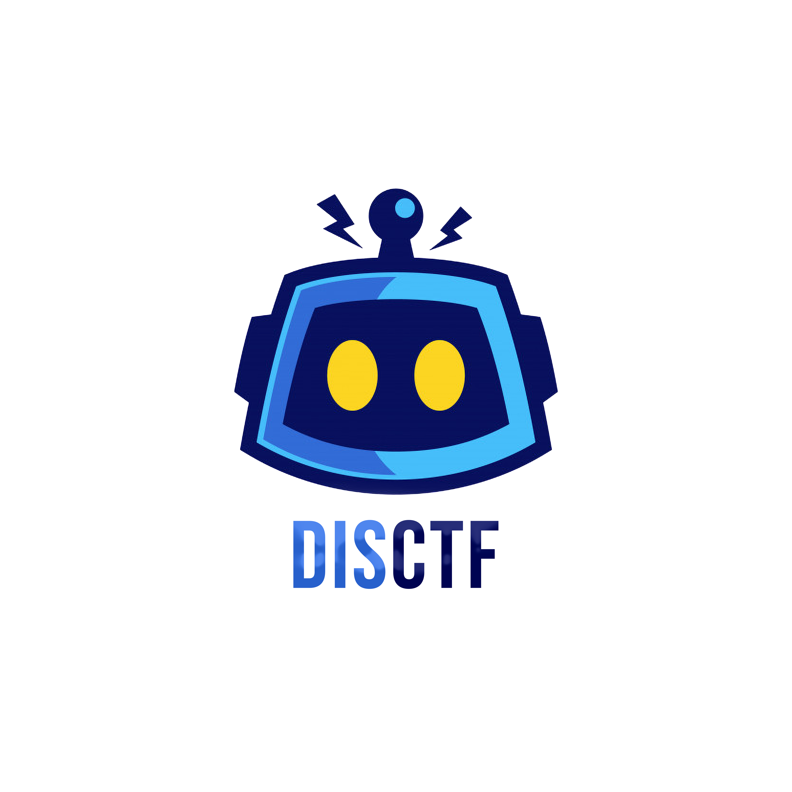

<h1 align="center">
<br>
<a href="https://disctf.live"></a>
<br>
DisCTF
</h1>
<h3 align="center">Discord Bot for Realtime Updates from CTFd</h3>
<br>
<p align="center">
<a href="https://www.gnu.org/licenses/gpl-3.0"></a>


</p>
<br><br>

DisCTF is a Discord bot developed to connect Discord server to CTFd framework with a centralized system for real-time notifications. CTFd bot is capable of monitor real-time solves and submission and filter out valid once, sends notifications on each solves with beautiful and colorful embeds with current rank and score of the person who solved with a timestamp in it. We have a live scoreboard that notifies the people on a repeated schedule of 1 minute with ranks of the top 20 players. You can interact with CTFd framework with custom commands that are programmed to fetch particular details from server and display you the necessary Details in easy Fashion and cool look.

<br>


## How Bot Works :
<br>

The bot has an interactive Dashboard page, you have to log in with Discord and add the bot to server. Once done you can configure the CTFd by providing CTF name, URL and Discord channel to use for the notifications. You are asked for admin credentials or session token and once done, just enable the bot and it will look for submissions and notify you in the provided channel. The bot is made independent of platform, submission logs are be viewed only by admin privileged user and a normal user can't view those. We have enabled few commands like /challenge which lists out active challenges. You can also filter out a specific challenge for information and if not then a particular category too. We have enabled User and Team information as well as Scoreboard Features. We are using the rest framework of Django to connect to CTFd, and if only the user account token is provided we can get the information as well. We are using REST framework because we don't want our bot to spam your CTFd server so it won't be giving you server load also. The information used to access CTFd is not stored in any database but is only used to request for specific privileges.

<br>


## How to Use DisCTF:

1. **Clone the repository:**
   ```bash
   git clone https://github.com/0x00daemon/ctf_bot
   ```

2. **Install the Requirements:**
   ```bash
   pip3 install -r requirements.txt
   ```

3. **Obtain CTFd Admin Session Cookie:**
   - Log in to CTFd using the admin user.
   - Open browser inspect, navigate to the application tab, and select the cookie option.
   - Copy the admin session cookie value.

4. **Get Discord Channel ID for Notifications:**
   - Enable [developer options](https://support.discord.com/hc/en-us/articles/206346498-Where-can-I-find-my-User-Server-Message-ID/) in Discord.
   - Copy the channel ID where you want to receive Discord notifications.

5. **Create and Configure Discord Bot:**
   - Create a Discord bot at [Discord Developer](https://discord.com/developers/applications).
   - Retrieve the bot token and update the `bot.py` file with the token.

6. **Update Bot Token in `bot.py` File:**
   - Open `bot.py` and change `Token = None` to `Token = "<yourtoken>"`.

7. **Start the Bot to Monitor CTFd:**
   ```bash
   python3 bot.py -s <session cookie> -u <url> -c <discord channel id>
   ```
   - Replace `<session cookie>` with the copied cookie value.
   - Replace `<url>` with your CTFd website URL.
   - Replace `<discord channel id>` with the copied channel ID.

8. **Invite DisCTF Bot to Your Discord Server:**
   Use the following link, replacing `<your_client_id>` and `<yourpermissionsreq>`:
   ```
   https://discord.com/api/oauth2/authorize?client_id=<your_client_id>&permissions=<yourpermissionsreq>&scope=bot
   ```
   - For permissions, use `274877974528` for message sending and reading old messages.

9. **Enable Bot Permissions:**
   - In the Discord Developer portal, enable presence intent, server members intent, and message content intent.

10. **Test and Confirm:**
   - Once the bot joins your server, run the DisCTF server (Step 7).
   - Confirm the bot is online, and in the selected channel, you should see the welcome message.

11. **Troubleshooting:**
   - If you encounter errors like the Token error, ensure the token is wrapped in double quotations.
   - Grant proper permissions for DisCTF bot for sending and receiving messages.

12. **Test Run:**
   - Before using in a big event, test the bot on demo.ctfd.io with admin credentials.

NOTE: ALL THE MESSAGES THAT ARE PRESENTED BY THE BOT CAN BE CUSTOMIZED IN THE ```bot.py``` FILE.

## Docker deployment - Recommended

Build the Docker image:

- Include the token inside the bot.py file. Token can be created by logging into the CTFd as admin and generating a token from profile (make sure to adjust the date for the validation of the token).
- Create a discord app/bot. Go to the bot section/tab and reset token to generate a token and enable all the intents options on the same page and add some cool icons and banners.

```bash
sudo docker build -t ctf_bot .
```

Start the container with your configuration:

```bash
docker run -d \
  -e SESSION_COOKIE=<your_cookie_here> \
  -e URL=<your_url_here> \
  -e DISCORD_CHANNEL_ID=<your_channel_id_here> \
  ctf_bot
```
- find the SESSION_COOKIE by logging into your ctfd platform (through admin account) and copy the cookie by going to inspect and then application tab and there you will find the cookie (this is on chrome).
- for URL just put in the url for the ctf like https://ctf.google.com.
- for the discord channel ID include the discord channel that you will be using for the ctf. Copy the channel id using: https://support.discord.com/hc/en-us/articles/206346498-Where-can-I-find-my-User-Server-Message-ID

lastly don't forget to invite the bot to the discord server using the link:
Use the following link, replacing `<your_client_id>` and `<yourpermissionsreq>`:
   ```
   https://discord.com/api/oauth2/authorize?client_id=<your_client_id>&permissions=<yourpermissionsreq>&scope=bot
   ```
   - For permissions, use `274877974528` for message sending and reading old messages.
   - For client ID look in the discord app/bot, in the OAUTH tab.

These commands create and run a Docker container for your bot. Ensure that you customize the environment variables with your own data to enable proper functionality.

### Support

If you need help deploying the bot for a CTF event, join the Discord channel: [https://discord.gg/unB3tzuS9b](https://discord.gg/unB3tzuS9b)

### License

**DisCTF** is licensed under the [GPL v3.0 license](https://www.gnu.org/licenses/gpl-3.0.en.html).
